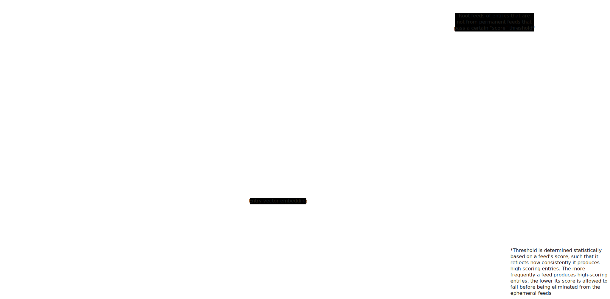

# Plan (for MVP)

- [ ] Bare minimum single-entry fetching, _i.e._, given some URL, and optionally some more metadata, fetch the full content and metadata on that page.
- [ ] Bare minimum single-feed fetching, _i.e._, given some feed URL, whether Atom or RSS, parse them into entries, which is fetched as per above.
- [ ] Parsers, to parse the full content of an entry into a unified, plain text format (markdown?).
- [ ] Storage of entries and feeds in a database.
- [ ] Embedding each entry, and using it as a bare-bones 'score'.
- [ ] Bookkeeping to keep track of read, bookmarked, liked, and disliked entries.
- [ ] Recomendder, responsible for taking into account similarity to liked/disliked entries, recency (including recency of a like or dislike), etc., to score entries.
  - $k$-nearest-neighbour graph with entries as vertices, cosine similarity as edge weights, and edges $(v, w)$ if and only if $v$ and $w$ are in each other's $k$-nearest-neighbourhood. Then, similarity becomes the Personalised PageRank between the two vertices.
- [ ] Scheduler which constantly decides what to fetch when (NOTE: implement a trait shared between `Feed` and `Entry` so that they can be arbitrarily fetched by the scheduler).
  - [ ] Figure out adaptive feed scheduling, _i.e._ how to figure out what the optimal refresh rate for a feed is 
  - [ ] Maybe `Scheduler` should be decomposed into `Scheduler` (for deciding when to refresh each feed) and `Fetcher` (given an arbitrary queue of `Fetchable`s (feeds and entries), pull them based on some policy).
- [ ] Feed scoring (that is, how should a feed be scored given its components, _e.g._ its entries and their scores?).
- [ ] Feed discovery for `Entry` to enable the creation of _ephemeral feeds_
  - [ ] Figure out how to decide a score threshold for a feed of a given state such that the more consistently a feed produces good content, the lower its score is allowed to drop before being purged.
